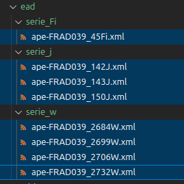

# Service d'archives imaginaire

> Cette page est un support pédagogique autour de l'OAI PMH.

Bienvenue sur le portail d'un service d'archives imaginaire ! Sur ce site minimaliste, il n'y a pas grand chose (il pourrait y avoir l'actualité du service et des projets de valorisation, les horaires d'ouverture du service, etc.). 

En tout cas, dans notre scénario, on a mis en place l'API OAI-PMH qui expose nos données. On travaille avec le service informatique qui gère l'API et le téléversement des fichiers XML/EAD sur le serveur.

> Cependant, on pourrait imaginer que c'est à l'archiviste de gérer directement les mises en ligne des IR via le CMS [OMEKA]([OAI-PMH Repository - Omeka Classic User Manual](https://omeka.org/classic/docs/Plugins/OaiPmhRepository/)), installé par le service informatique et dont un accès administrateur aura été configuré pour l'archiviste. L'objectif, ici, est de comprendre la logique générale des verbes de l'OAI-PHM avec une structure simple.

On a construit notre API autour de cette URL (qui ne renvoie rien, c'est normal car, comme on l'a vu, OAI-PHM repose sur la logique des verbes + paramètres)

```
http://localhost:8000/oai-pmh.php
```

> Le code est basé sur ce projet (qui, cependant, a été modifié) :
> 
> - [GitHub - spouyllau/csv2oai: CSV2OAI : Serveur OAI-PMH pour fichier CSV en PHP ≥ 7.2](https://github.com/spouyllau/csv2oai)
> 
> - POUYLLAU, S. (CNRS) with Mistral 7b, *CSV2OAI : Serveur OAI-PMH pour fichier CSV*, juillet 2025.
> 
> Les instruments de recherche utilisés pour l'exemple ont été choisi aléatoirement à partir des IR des AD 39.

⚠️ Rappel : pour voir les données complètes renvoyées , je vous recommande d'utiliser `curl` ou bien de faire un CTRL+U (afficher le code source de la page).

## Sur l'entrepôt du Service d'archives imaginaire (Identifier)

On expose donc nos métadonnées via cette "action" OAI-PMH qu'est "Identifier" :

```
http://localhost:8000/oai-pmh.php?verb=Identify
```

Je vous invite à entrer tester l'URL !

Elles renseignent sur notre service d'archives imaginaire. On a pas renseigné grand chose, mais on voit que le verbe renvoie des informations sur l'entrepôt. C'est un bon premier pas, et il peut être intéressant de tester sur différents sites (francearchives, bnf, abes, etc.) ce verbe pour comprendre la logique. Je vous soumets la réponse pour France Archives :

- https://francearchives.gouv.fr/oai?verb=Identify

Maintenant, faire une recherche avec l'API OAI-PHM de la BnF et de l'entrepôt Calames.

> S'autoriser à lire la documentation surtout !

On voit qu'on a donc le lien de l'API autour duquel se construit nos requêtes (qui sont des raffinements de la méthode HTTP "GET", comme on l'a vu). Ici, on indique notre premier verbe avec `?`  puis on lui assigne une valeur `Identify` qui fait se comporte comme une fonction : un verbe est une action, et on lui dit quelle action on veut (obtenir les métadonnées identificatrices de l'entrepôt).

## Quel genre de données ? (ListMetadataFormat)

On expose des données, certes, mais dans quel(s) formats? Ici, du XML/EAD ! On peut le voir avec :

```
http://localhost:8000/oai-pmh.php?verb=ListMetadataFormats
```

Qui affiche 

```
<?xml version="1.0" encoding="UTF-8"?>
<OAI-PMH xmlns="http://www.openarchives.org/OAI/2.0/">
  <responseDate>2025-07-19T18:18:09Z</responseDate>
  <request verb="ListMetadataFormats">http://localhost:8000/oai-pmh.php</request>
  <ListMetadataFormats>
    <metadataFormat>
      <metadataPrefix>oai_dc</metadataPrefix>
      <schema>http://www.openarchives.org/OAI/2.0/oai_dc.xsd</schema>
      <metadataNamespace>http://www.openarchives.org/OAI/2.0/oai_dc/</metadataNamespace>
    </metadataFormat>

    <metadataFormat>
      <metadataPrefix>ead</metadataPrefix>
      <schema>urn:isbn:1-931666-22-9</schema>
      <metadataNamespace>urn:isbn:1-931666-22-9</metadataNamespace>
    </metadataFormat>
  </ListMetadataFormats>

</OAI-PMH>
```

Sur OAI-DC. C'est en fait le format de métadonnées obligatoire que tout entrepôt OAI-PMH doit pouvoir fournir. C'est la "langue commune"  qui permet à n'importe quel moissonneur de comprendre les métadonnées, même s'il ne connaît pas les formats plus spécifiques (comme l'EAD). (Il est baés sur Dulin Core.)

Sur EAD. Regardons de plus près :

```xml
 <metadataFormat>
      <metadataPrefix>ead</metadataPrefix>
      <schema>urn:isbn:1-931666-22-9</schema>
      <metadataNamespace>urn:isbn:1-931666-22-9</metadataNamespace>
    </metadataFormat>
  </ListMetadataFormats>
```

On indique qu'on gère l'EAD ! Attention, sur d'autres dépôts, on peut avoir ape_ead, qui est en fait une variante "européenne" de l'EAD. (Donc utile pour le portail agrégateur européen).

- [Le portail européen des archives (FranceArchives)](https://francearchives.gouv.fr/fr/article/37953)

    

## Quels sont nos ensembles de données: ListSets

```
http://localhost:8000/oai-pmh.php?verb=ListSets
```

Le classement des IR en ensembles dépend de l'organisation du service d'archives. C'est facultatif d'organiser en sets, mais pour notre exemple on pose 1 set = 1 série. On voit qu'on a différents éléments, mais on va se concentrer sur l'EAD. On a décidé avec le Service Informatique que les fichiers XML/EAD exposés seront à déposer dans le dossier "EAD" ; et qu'un dossier = 1 série :



> Dans notre cas, c'est le Service Informatique qui se charge de mettre les IR en EAD dans le bon dossier sur le serveur. En tant qu'archiviste, on ne lui soumet que les fichiers EAD bien formés, avec les bons identifiants, etc.

En utilisant le verbe ListSets on a donc :

```xml
<?xml version="1.0" encoding="UTF-8"?>
<OAI-PMH xmlns="http://www.openarchives.org/OAI/2.0/">
  <responseDate>2025-07-19T18:35:07Z</responseDate>
  <request verb="ListSets">http://localhost:8000/oai-pmh.php</request>
<ListSets>
  <set>
    <setSpec>Photo1</setSpec>
    <setName>Photo1</setName>
  </set>
  <set>
    <setSpec>Photo2</setSpec>
    <setName>Photo2</setName>
  </set>
  <set>
    <setSpec>serie_Fi</setSpec>
    <setName>Serie_Fi</setName>
  </set>
  <set>
    <setSpec>serie_w</setSpec>
    <setName>Serie_w</setName>
  </set>
  <set>
    <setSpec>serie_j</setSpec>
    <setName>Serie_j</setName>
  </set>
</ListSets>
</OAI-PMH>
```

> Ignorons pour l'instant les deux premiers ensembles ! Ce sont des données qui sont sur notre serveur, mais qui ne sont pas des XML/EAD : l'idée est de montrer que OAI-PMH permet d'exposer différents types de données.

On remarque que ce sont les noeuds `setSpec` qui ont le nom du "dossier" de nos instruments de recherche; et qu'il y a une mise en forme pour `<setName>` (ici arbitraire). Bref : on émet l'hypothèse que setSpec donne une information plus structurelle que setName.

Testons maintenant sur France Archives :

```
https://francearchives.gouv.fr/oai?verb=ListSets
```

On a des éléments XML qui ressemblent à ça :

```xml
<set>
    <setSpec>findingaid:service:FRMAE</setSpec>
    <setName>Archives diplomatiques</setName>
</set>
```

Ah ! On voit que les ensembles sont ceux des différents services d'archives -- qui sont d'ailleurs moissonnés.  Ainsi, pour les Archives Diplomatiques, on apprend que ce qu'on a appelé une information structurelle est `findingaid:service:FRMAE` dans les balises `<setSpec>`.

Posons une hypothèse : cela veut dire que si on voudra moissonner l'ensemble des IR des Archives Diplomatiques, il faudra sans doute utiliser le nom de cet ensemble !

## Moissonner

### A) Avant tout, savoir identifier.

#### Afficher la liste des "records" disponibles: ListRecords, ListIdentifiers

**ListRecords**. Les choses deviennent intéressantes ! On va enfin pouvoir commencer à entrevoir les questions de *moissonnage*. Mais avant de moissonner des tas d'IR, on va commencer par apprendre à en récupérer un via OAI-PMH.

Alors comment récupérer *un* instrument de recherche ? Pour récupérer *un* instrument de recherche, il faut déjà savoir comment il est identifié. On peut donc afficher l'ensemble des *records* disponibles avec le verbe `ListRecords` :

```
http://localhost:8000/oai-pmh.php?verb=ListRecords
```

Chaque *record* est décrit entre deux balises `<record>`. On voit qu'on a dix *records* (8 instruments de recherche en XML/EAD, et deux entités stockées dans un fichier csv. On ignore le fichier .csv, qui ici permet de montrer, avec le jeu des distinctions, que OAI-PHM n'est pas seulement utile pour exposer du XML/EAD, mais aussi d'autres type de données. 

> Ce n'est pas important d'entrer dans les détails autour du csv, mais ici, notre .csv fait office de base de données en table. Chaque ligne (ou "enregistrement") de notre table .csv est considéré comme un élément à exposer par OAI-PHM. Ici, c'est le Dublin Core qui en décrit les métadonées.  C'est pour cela que ListMetaDataFormats ne renvoie pas "csv" ET "ead". Csv est un moyen de stocker des données, pas de les décrire. On utilise non pas XML pour décrire ses lignes, mais Dublin Core. Bref, ce n'est pas l'essentiel, ici on a gardé le .csv pour avoir des données différentes de XML, pour montrer des différences.

En effet, si on regarde une de nos représentation XML d'un de nos IR :

```xml
<metadata>
    <oai_dc:dc xmlns:oai_dc="http://www.openarchives.org/OAI/2.0/oai_dc/" 
                 xmlns:dc="http://purl.org/dc/elements/1.1/" 
                 xmlns:xsi="http://www.w3.org/2001/XMLSchema-instance" 
                 xsi:schemaLocation="http://www.openarchives.org/OAI/2.0/oai_dc/ 
                 http://www.openarchives.org/OAI/2.0/oai_dc.xsd">
      <dc:title>2684W Administration générale, foncier d&#039;aménagement, de travaux et d&#039;exploitation en forêts publiques et privées dans le ressort du centre de gestion de Dole</dc:title>
      <dc:creator>Office national des forêts, unités territoriales de Dole (Dole-Chaux et Dole)</dc:creator>
      <dc:date>1929-2002</dc:date>
      <dc:type>PhysicalObject</dc:type>
      <dc:format>application/xml</dc:format>
    </oai_dc:dc>
  </metadata>
```

On voit qu'on a dans `<dc:format>` l'expression `application/xml`. On ne retrouve pas application/xml pour nos deux objets qui ne sont pas des IR. Si on compte les application/xml (avec XPath ou bien un simple contrôle F), on a bien 8 occurences.

> Ces éléments ne sont pas nos IR eux-mêmes, mais leurs représentations qui permettent de les lister ! 

Si on fait `ListRecords` sur France Archives : ça ne marchera pas ! C'est une restriction côté serveur car il y a des centaines de milliers d'instruments de recherche et demander autant d'IR d'un coup ça pourrait poser des problèmes. Il faut donc en demander moins avec des **filtres**. 

**ListIdentifiers**. Mais avant de parler des filtres, on peut aussi utiliser `ListIdentifiers` pour afficher une information moins prolixe :

```
http://localhost:8000/oai-pmh.php?verb=ListIdentifiers
```

On obtient quelque chose comme (frament) ça, avec une liste de `<header>`:

```xml
<?xml version="1.0" encoding="UTF-8"?>
<OAI-PMH xmlns="http://www.openarchives.org/OAI/2.0/">
  <responseDate>2025-07-20T08:49:53Z</responseDate>
  <request verb="ListIdentifiers">http://localhost:8000/oai-pmh.php</request>
  <ListIdentifiers>
<header>
  <identifier>oai:example:1</identifier>
  <datestamp>2025-07-06</datestamp>
  <setSpec>Photo1</setSpec>
</header>

    ...

<header>
  <identifier>FRAD039_143J</identifier>
  <datestamp>1960-1997</datestamp>
  <setSpec>serie_j</setSpec>
</header>
<header>
  <identifier>FRAD039_150J</identifier>
  <datestamp>2022</datestamp>
  <setSpec>serie_j</setSpec>
</header>
  </ListIdentifiers>
</OAI-PMH>
```

Encore une fois, on ne s'intéresse qu'aux noeuds qui représentent nos IR.  La chose la plus important ici, c'est que chaque IR est modélisé avec des balises ; et, surtout, qu'on a leur identifiant dans `identifier`. C'est important donc je mets un warning!

⚠️ Cet identifiant est récupéré depuis le XML/EAD, dans l'attribut identifier de l'imprescindible balise `eadid`  OU en capturant directement le noeud textuel (entre les deux balises `<eadid>`:

```xml
<eadid url="http://archives39.fr/ark:/36595/a0114234955678hrxDs" countrycode="FR" identifier="FRAD039_45Fi">FRAD039_45Fi</eadid>
```

Dans le cas du moissonnage national, il me semble (à vérifier) que c'est l'attribut identifier qui est choisie en priorité sur le noeud textuel (dans tous les cas il faut mettre les deux car sinon c'est un fichier XML mal formé... bref). En tout cas, l'idée à retenir, c'est que l'identifiant, qui est obligatoire car très important, permet aux IR d'être "piochés" par un système informatique. C'est une porte d'entrée d'un système vers les IR.

> Si on fait ListIdentifiers sur France Archives, que se passe-t-il ? Eh bien ça ne marche pas non plus : il y a trop de données. Il faudra donc utiliser un filtre pour pouvoir afficher des données dans un nombre raisonnable.

#### Les filtres

On a vu que certains services OAI-PHM, pour des raisons techniques/de sécurité, imposaient des restrictions. Pour obtenir des données (et ne pas tout afficher), il faut donc avoir une demande plus fine, plus spécifique. Pour ce faire, on utilise des filtres.

Un filtre, ça consiste à ajouter à une action (donc à un verbe), une condition d'égalité. 

Concrètement, si on veut récupérer la liste des identifiants de nos instruments de recherche en série W (et PAS le reste), on fait :

```
http://localhost:8000/oai-pmh.php?verb=ListIdentifiers&set=serie_w
```

Dès qu'on ajoute un paramètre, on met une esperluette (le point d'interrogation étant réservé au premier paramètre). Puis on indique un élément XML et enfin la valeur désirée.

L'idée donc, est de décomposer notre demande du général au particulier : je veux la liste des identifiants ET ("Mais") seulement ceux de tel service d'archives.

Mais avant d'essayer avec France Archives, il faut continuer notre exploration des verbes et de la logique d'OAI-PMH.

### B) GetRecord : moissonner un (1) instrument de recherche

On va enfin pouvoir moissonner ! Mais pour commencer, avec un seul IR. Le verbe pour ça c'est `GetRecord`. Essayez de le faire pour notre service d'archives imaginaire.

> Alors ? ça marche ?

Non : ça ne marchera pas ! Car il on demande de récupérer un IR, mais pas lequel ! On voit donc qu'il est important de savoir identifier des IR (voire des ensembles d'IR).

> Comment fait-on déjà pour "identifier" un IR? Eh bien "ListIdentifiers"! 
> 
> > Je vous invite, avec les filtres, à récupérer la liste des identifiants de la série J. Je donne la réponse juste après au cas où !
> 
> **Réponse** :
> 
> On fait affiche tous les identifiants avec ListIdentifiers, puis on filtre en sélectionnant l'ensemble de la série J.
> 
> - http://localhost:8000/oai-pmh.php?verb=ListIdentifiers&set=serie_j
> 
> Note : si on a oublié quels sont nos ensembles, on peut faire :
> 
> - http://localhost:8000/oai-pmh.php?verb=ListSets

Normalement on récupère une liste de `<header>`, voyez plutôt :

```xml
<?xml version="1.0" encoding="UTF-8"?>
<OAI-PMH xmlns="http://www.openarchives.org/OAI/2.0/">
  <responseDate>2025-07-20T09:38:48Z</responseDate>
  <request verb="ListIdentifiers">http://localhost:8000/oai-pmh.php</request>
  <ListIdentifiers>
<header>
  <identifier>FRAD039_142J</identifier>
  <datestamp>1639-1991</datestamp>
  <setSpec>serie_j</setSpec>
</header>
<header>
  <identifier>FRAD039_143J</identifier>
  <datestamp>1960-1997</datestamp>
  <setSpec>serie_j</setSpec>
</header>
<header>
  <identifier>FRAD039_150J</identifier>
  <datestamp>2022</datestamp>
  <setSpec>serie_j</setSpec>
</header>
  </ListIdentifiers>
</OAI-PMH>

```

On veut récupérer l'IR de 1639/1991 : sont identifiant est `FRAD039_142J`.

> Même si on a pas vu comment utiliser GetRecord, ça peut être intéressant d'imaginer comment faire sans regarder la réponse. Pensez aux filtres !

Normalement, si vous avez essayé de "get" ce record, vous avez essayé ça :

```
http://localhost:8000/oai-pmh.php?verb=GetRecord&identifier=FRAD039_142J
```

Mais... ça ne marche pas ?

La solution : **metadataPrefix**. En effet, on a obtenu quelque chose de similaire à `ListRecords` ! Et pas l'instrument de recherche XML/EAD lui-même ! En effet, on a demandé ici la représentation du XML/EAD et pas le XML lui-même. Pour obtenir le contenu, il faut préciser qu'on veut récupérer l'EAD natif avec `&metadataPrefix=ead `. Il faut donc ajouter un autre paramètre :

```
http://localhost:8000/oai-pmh.php?verb=GetRecord&identifier=FRAD039_142J&metadataPrefix=ead
```

Si on utilise le terminal et curl, on peut télécharger directement nos fichiers de cette façon :

```shell
curl 'http://localhost:8000/oai-pmh.php?verb=GetRecord&identifier=FRAD039_142J&metadataPrefix=ead' > mon_ir.xml
```

> Note : ici, comme nous l'a renseigné ListDataFormat, on a "ead", mais on a souvent "ape_ead" pour les entrepôts comme France Archives.

Si on essaye sur France Archives, que se passe-il ?  ça ne marche pas non plus ! 

En fait, toute requête est "sécurisée", et il faut passer par des chemins plus tortueux...

### Restrictions, restrictions

Imaginons qu'on veut télécharger un IR des AD de l'Eure. Quelles sont les étapes à suivre ? On reprend du début :

1. Récupérer l'identifiant du "set" qui représente les AD de l'Eure (27) : `https://francearchives.gouv.fr/oai?verb=ListSets`

2. On récupère l'identifiant (évidemment, c'est `findingaid:service:FRAD027`)

3. On l'utilise pour récupérer l'ensemble des identifiants des IR avec ListIdentifiers : `https://francearchives.gouv.fr/oai?verb=ListIdentifiers&metadataPrefix=ape_ead&set=findingaid:service:FRAD027`

Mais là, au lieu d'avoir notre liste de `<header>`, on a un truc qui ressemble à un hash :

```
<identifier>
757bf16c82ca4c4a89365c530bc0a1dd48fe9c07
</identifier>
```

C'est une sorte d'emprunte unique, mais peu importe ici de parler de l'utilité d'avoir une emprunte (en gros, si il y a un changement du côté des données, le hash sera différent, ce qui permet au moissonneur de regarder si les clés changent; et s'ils elles changent alors il y a de nouvelles choses à récupérer). Ce hash est donc l'identifiant (unique) d'un instrument de recherche -- et *d'un seul* instrument de recherche.

Si je place cet identifiant dans le filtre identifier (en exigeant le contenu ead complet avec metadataPrefix) :`

```
https://francearchives.gouv.fr/oai?verb=GetRecord&identifier=757bf16c82ca4c4a89365c530bc0a1dd48fe9c07&metadataPrefix=ape_ead
```

Je récupère bien le contenu complet d'un instrument de recherche.

> C'est bizarre : ListIdentifier ne renvoie qu'un IR alors ? On ne peut récupérer que cet instrument de recherche ? La question de la restriction revient : Cette conception est une mesure de protection cruciale pour la  stabilité et la performance des grands entrepôts de données comme FranceArchives. SI on  imagine que ce ne soit pas le cas, un utilisateur (ou un robot) pourrait faire une requête sur un set qui contient non pas 61, mais 500 000 instruments de recherche... ça pourrait casser le serveur.

**Il faut donc comprendre que, sur France Archives, il faut passer par des stratagèmes plus alambiqués pour obtenir des identifiants et des IR !**

### Resumption Token

C'est un point clé pour comprendre le moissonnage OAI-PHM, et les stratagèmes de restrinctions liés aux enjeux de sécurité des systèmes informatiques.

Pour comprendre commencer récupérer les autres IR, il faut retourner voir ce que retourne notre ListIdentifers. Il y a des choses de très intéressantes (et importantes) :

```xml
<resumptionToken expirationDate="2025-07-20T11:21:40Z" completeListSize="61" cursor="0">
Njc4NTc2NDU0fmZpbmRpbmdhaWQ6c2VydmljZTpGUkFEMDI3fn5-YXBlX2VhZH42MX4x
</resumptionToken>
```

L'attribut `completeListSize` nous indique qu'il y a une liste de 61 identifiants (donc 61 IR disponibles via l'API). Et on a également une sorte de clé aléatoire, unique, qui a une date d'expiration. Mais continuons notre tour du propriétaire. En informatique, quand on compte, on commence à zéro. Notre `cursor` nous indique qu'on est au début de la liste. Donc, lorsqu'on a fait un `GetRecord` sur notre premier identifiant, on a récupéré en fait l'élément 0 et nous délivre le "ticket" (le Resumption token) pour récupérer l'IR suivant.

> Inutile de copier / coller mon code ! les tokens sont périmés.

Ainsi, si j'utilise le ticket avec le filtre approprié, je récupére l'identifiant de l'instrument de recherche suivant (n°1) et le ticket pour le prochain instrument de recherche :

```
https://francearchives.gouv.fr/oai?verb=ListIdentifiers&resumptionToken=NTg1MTM4NDUxfmZpbmRpbmdhaWQ6c2VydmljZTpGUkFEMDI4fn5-YXBlX2VhZH42MX4x&metadataPrefix=ape_ead
```

Je trouve ainsi:

```xml
<identifier>9f05ebc3a4d365ddb0cf73c5ee415868f3e2a3bc</identifier>
```

Et :

```xml
<resumptionToken expirationDate="2025-07-20T12:22:16Z" completeListSize="61" cursor="1">NTg1MTM5MzI5fmZpbmRpbmdhaWQ6c2VydmljZTpGUkFEMDI4fn5-YXBlX2VhZH42MX4y</resumptionToken><
```

Donc, de façon récursive (avec un programme par exemple), je peux donc récupérer d'abord l'IR avec le nouvel identifiant hashé:

```
https://francearchives.gouv.fr/oai?verb=GetRecord&identifier=9f05ebc3a4d365ddb0cf73c5ee415868f3e2a3bc&metadataPrefix=ape_ead
```

Puis consommer mon ticket pour afficher la suite :

```
https://francearchives.gouv.fr/oai?verb=ListIdentifiers&resumptionToken=NTg1MTM4NDUxfmZpbmRpbmdhaWQ6c2VydmljZTpGUkFEMDI4fn5-YXBlX2VhZH42MX4x&metadataPrefix=ape_ead
```

Et ainsi de suite jusqu'à avoir collecté les 61 IR.

## Un code

Evidemment, moissonner demanderait de savoir coder. De fait, étant donné que c'est justement normalisé, on peut proposer un script de base pour effectuer le moissonnage (qui a l'ajuster soi-même où effectuant des modifs avec du "vibe-coding". Mais il m'a semblé intéressant de présenter ces aspects un peu techniques pour avoir un aperçu complet d'OAI-PMH !

## Conclusion

Ce tutoriel est un aperçu d'OAI-PMH. Le mieux est d'essayer les verbes et les filtres directement avec les entrepôts BnF, Calames, etc.